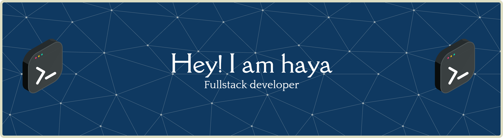

## Hi there👋 

## ✍ About Me
 
🔭 I’m currently working on my education is in the information technology department
🌱 I’m currently learning human-computer interaction course
📫 You can contact me via Instagram: hayahasibuan and email: hasibuanrohaya00@gmail.com
😄 Pronouns: yours
🚀 other: C++, Python, and Web Development 
🎯 Goal: Becoming a professional software developer

## 💻 Tech Stack

## 💡 Badges

https://github.com/RohayaHasibuan

https://www.instagram.com/hayahasibuan/

https://www.threads.net/@hayahasibuan

## 📊 GitHub Stats

## 🐍 Snake & Pacman

<picture>
  <source media="(prefers-color-scheme: dark)" srcset="https://raw.githubusercontent.com/RohayaHasibuan/RohayaHasibuan/output/pacman-contribution-graph-dark.svg">
  <source media="(prefers-color-scheme: light)" srcset="https://raw.githubusercontent.com/RohayaHasibuan/RohayaHasibuan/output/pacman-contribution-graph.svg">
  
</picture>

###

###

<!--
**RohayaHasibuan/RohayaHasibuan** is a ✨ _special_ ✨ repository because its `README.md` (this file) appears on your GitHub profile.

Here are some ideas to get you started:

- 🔭 I’m currently working on ...
- 🌱 I’m currently learning ...
- 👯 I’m looking to collaborate on ...
- 🤔 I’m looking for help with ...
- 💬 Ask me about ...
- 📫 How to reach me: ...
- 😄 Pronouns: ...
- ⚡ Fun fact: ...
- 🏆
-->
